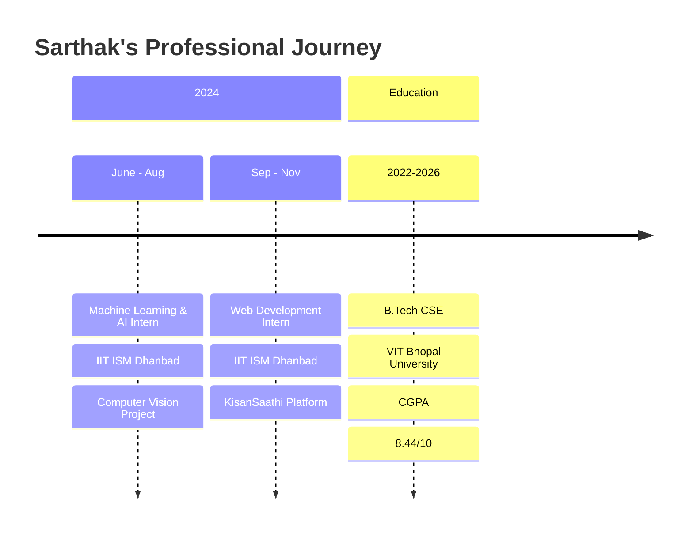

# <div align="center">
  
  
  
  

</div>

---

<div align="center">
  
  
  
  [](https://github.com/sarthakraj2903)
  [](https://github.com/sarthakraj2903)
  
</div>

---

##  **About Me**


```yaml
name: "Sarthak Raj"
located_in: "Bhopal, India"
current_job: "Computer Science Student"
education: 
  - "VIT Bhopal University"
  - "CGPA: 8.44/10"
  
fields_of_interests:
  - "Machine Learning & AI"
  - "Full Stack Development" 
  - "Cloud Computing"
  - "Computer Vision"
  
currently_learning: 
  - "Advanced AI/ML Algorithms"
  - "Kubernetes & Docker"
  - "AWS Cloud Architecture"
  
2024_goals:
  - "Contribute to Open Source"
  - "Build production-ready applications"
  - "Master cloud technologies"
```

---

##  **Technical Arsenal**

<div align="center">

### 🚀 **Languages & Frameworks**
<p>
  
</p>

### ☁️ **Cloud & DevOps**
<p>
  
</p>

### 🗄️ **Databases**
<p>
  
</p>

### 🤖 **AI/ML Tools**
<p>
  
  
  
  
</p>

### 📊 **Data Visualization**
<p>
  
  
  
</p>

</div>

---

##  **Featured Projects**

<div align="center">

### 🌟 **Project Showcase**

</div>

<table>
<tr>
<td width="50%">

### 🧠 **SkillBridge**


**AI-powered learning roadmap generator**
- 🎯 Personalized skill gap analysis
- 🔗 Curated resource recommendations
- 🤖 Gemini API integration
- 📈 Progress tracking dashboard

</td>
<td width="50%">

### 💰 **FinTrack-AI**


**Smart financial tracking platform**
- 📊 Subscription management
- 💡 AI expense recommendations  
- 📈 Advanced analytics dashboard
- 🔄 Real-time expense tracking

</td>
</tr>
<tr>
<td width="50%">

### 🌾 **KisanSaathi**


**Agricultural intelligence platform**
- 🌱 Smart crop recommendations
- 🔬 Disease diagnosis via image recognition
- 🌤️ Weather & soil analysis
- 👨‍🌾 Farmer-friendly interface

</td>
<td width="50%">

### 🚗 **License Plate Recognition**


**Computer Vision project @ IIT Dhanbad**
- 🎯 Real-time plate detection
- 🧠 Deep learning optimization
- 📸 Image processing pipeline
- ⚡ High accuracy & efficiency

</td>
</tr>
</table>

---

##  **GitHub Analytics**

<div align="center">
<a href="https://github.com/sarthakraj2903">


</a>
</div>

<div align="center">
  
</div>

<div align="center">
  
</div>

---

##  **Experience Timeline**

<div align="center">



</div>

---

##  **Certifications & Achievements**

<div align="center">

| 🏆 **Certification** | 🏛️ **Issuer** | ⭐ **Status** |
|:---:|:---:|:---:|
| **Oracle Cloud Foundation Associate** | Oracle | ✅ Certified |
| **Docker Foundational** | Docker | ✅ Certified |
| **Microsoft Azure AI Essentials** | Microsoft | ✅ Certified |
| **Machine Learning Internship** | IIT Dhanbad | ✅ Completed |
| **Web Development Internship** | IIT Dhanbad | ✅ Completed |

</div>

---

##  **Let's Connect & Collaborate**

<div align="center">

### 🌐 **Find me across the web**

[](https://linkedin.com/in/sarthak7070)
[](https://github.com/sarthakraj2903)
[](mailto:rajsarthak7070@gmail.com)
[](tel:+919102215255)

### 💡 **Open for opportunities in:**
- 🤖 Machine Learning Engineering
- ☁️ Cloud Solutions Architecture  
- 🌐 Full Stack Development
- 🔬 Research & Development


</div>

---

<div align="center">

**⭐ From [SarthakRaj2903](https://github.com/sarthakraj2903) with ❤️**


</div>
